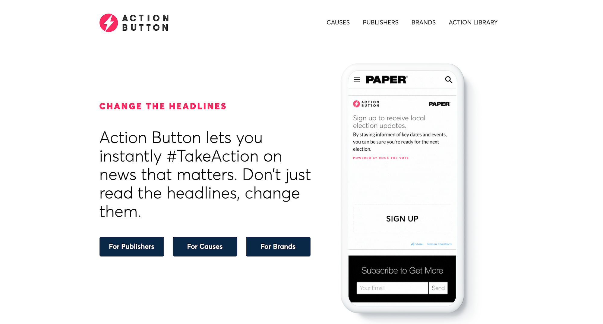
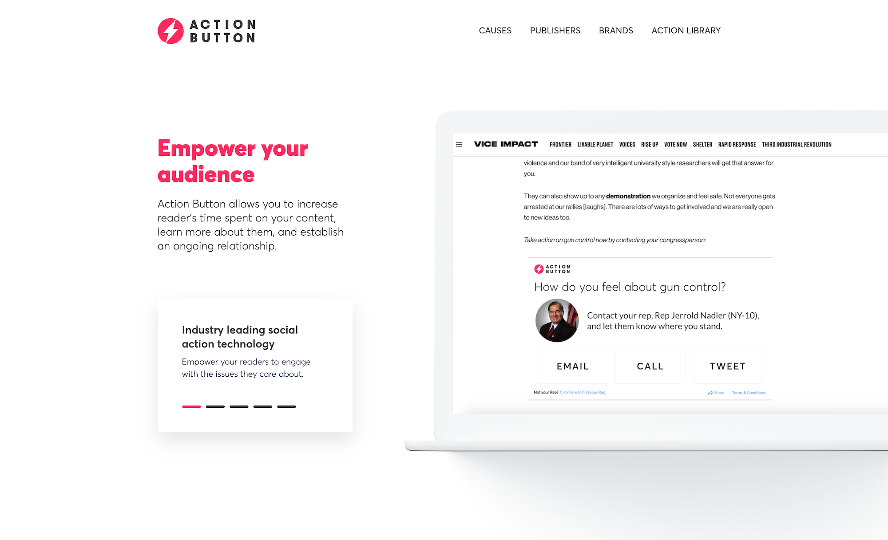

During my time as the lead-front end develoepr at Speakable.org, I was charged with building new products, product features, internal tools, and company websites [[A](https://actionbutton.org/), [B](https://speakable.org/)].
 
 
In the case of Action Button, my contriubtions improved upon existing codebase by reducing bundle size ~25%, limiting API usage, as well as increasing performance and user engagement. By developing highly-interactive and UX-focused experiences, we were able to increase our user interaction 10-20x.
 
 
Additional aspects of my work during my time at Speakable, which still remain private from the pubic, may be made available upon request.

--

Click [here](https://actionbutton.org/) to learn more about Action Button.

All content represented herein property of [Speakable.org](https://speakable.org/).

 
 

**action buttons**

<iframe style='width: 100%' frameborder='0' scrolling='no' height='450' src='https://embed.actionbutton.co/widget/widget-iframe.html?widgetId=SPK-QkFBRA=='></iframe>

<iframe style='width: 100%' frameborder='0' scrolling='no' height='450' src='https://embed.actionbutton.co/widget/widget-iframe.html?widgetId=SPK-Q0ZHQA=='></iframe>

**marketing websites**
 
 

 

 
