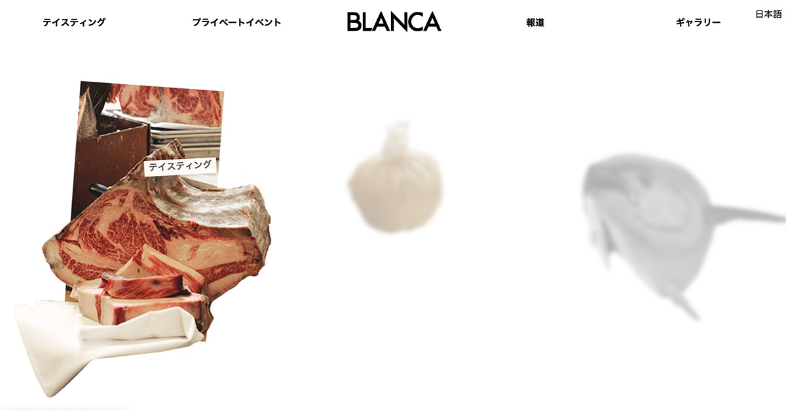
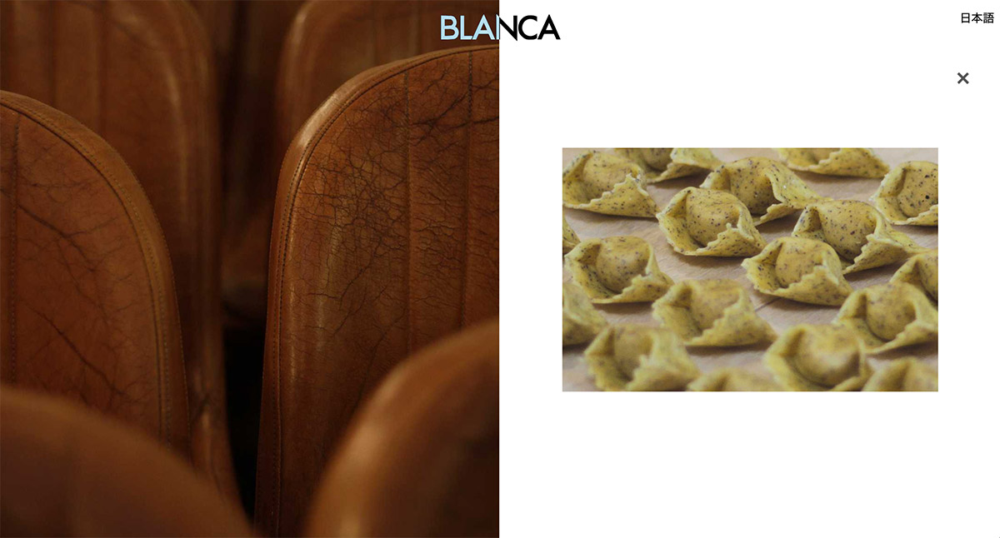
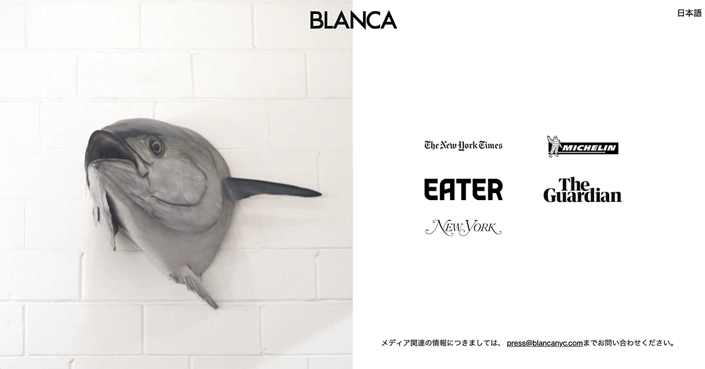

Gatsby-based website pulling data from Netlify CMS + multi-language internationalization. Animatons and transitions acomplished using GSAP.
 
 

 

 

 

 

`video: title: "Mobile UX": ./blanca_mobile_ux.mp4`

 

`video: title: "Desktop UX": ./blanca_desktop_ux.mp4`

